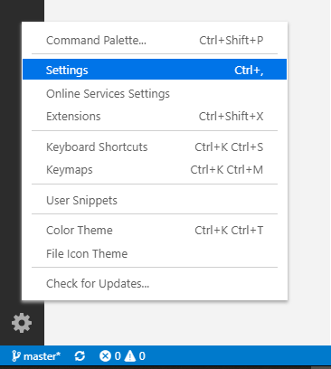
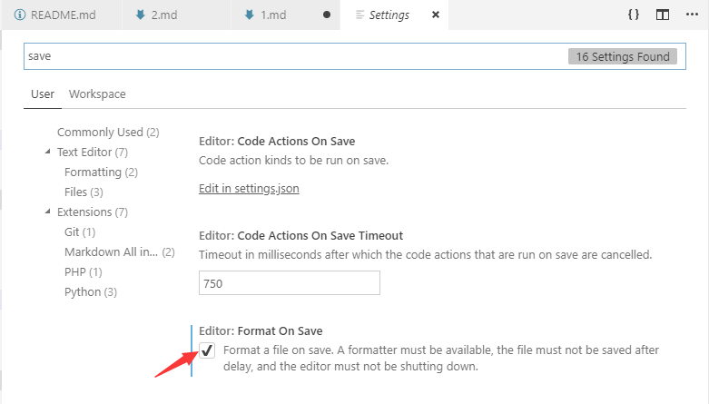
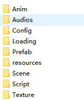

# 基础
## **编辑器推荐**
> [VSCode](https://code.visualstudio.com/)  
> 速度快，插件丰富，外观好看~ 没理由不选择它~  

> 推荐开打文件保存时自动格式化代码，这样代码会很规范。
>  

***
## **git工具推荐**
>Git 客户端 —— Sourcetree [安装教程](https://docs.cocos.com/creator/manual/zh/submit-pr/submit-pr.html)
***
## **文件夹命名推荐**
> 
* Anim-动画文件
* Audios-音效文件
* Config-配置文件
* Loading-不用管这个， 这个是之前为了实现微信小游戏加载界面，把单独加载界面资源都放到里面。
* Prefab-就是Prefab
* resources-cocos creator默认的 动态加载的文件夹 cc.loader 加载路径。
* Scene-场景
* Script-代码
* Texture-UI和游戏图片资源
 
***
## **代码规范**
> [骆驼命名法](https://baike.baidu.com/item/%E9%AA%86%E9%A9%BC%E5%91%BD%E5%90%8D%E6%B3%95)
***
## **.gitignore  配置**
> Cocos Creator 创建新项目已经会自动生成。 重要的是如下几行
``` 
#/////////////////////////////////////////////////////////////////////////////
# Cocos Projects
#/////////////////////////////////////////////////////////////////////////////

library/
temp/
local/
build/

```


