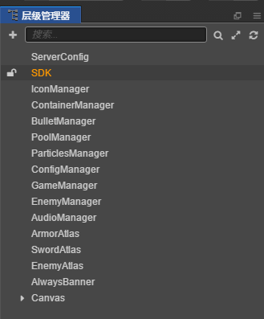
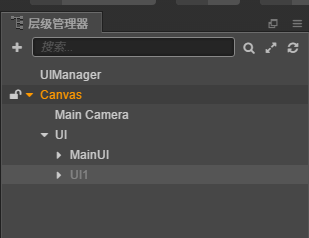
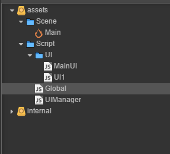

## **单件和UI管理**

[talk is cheap, show me the code 本章代码链接](code/2)
### **生命周期**
> [**Cocos creator 组件生命周期**](https://docs.cocos.com/creator/manual/zh/scripting/life-cycle-callbacks.html)  
> 很重要，需要仔细阅读 
### **单件**
> 全局唯一变量或模块，方便别的模块直接调用  
> 游戏中的各种管理模块：UI管理，音效管理，存档管理和游戏管理，都可以做成单件。  

Global.js
```js
var Global = {
    uiManager: null,
    //全局变量
    APPID: "123456",
}

module.exports = cc.Global = Global;
```
> 别的代码模块可以通过 cc.Global.uiManager 来获取到uiManager（现在时null，可以再别的地方初始化）。cc.Global.APPID 获取游戏ID 
> 也可以存储全局
***
> 其他项目 我写了好多Manager，方便调用   
  
比如专门用来存储SpriteFrame的Manager,json配置文件的Manager，都和UIManager类似

***
### **UI管理**
> 先参考下编辑器里面的结构   


> * DEMO 主要是MainUI上面弹出UI1界面的逻辑，UI1可扩展为各种弹框
> * UI1是默认关闭的
> * UIManager为管理所有UI的开启

> 先看下UIManager.js
```js
cc.Class({
    extends: cc.Component,

    properties: {
        ui1: cc.Node,
    },

    // LIFE-CYCLE CALLBACKS:

    onLoad() {
        cc.Global.uiManager = this;
    },

    start() {
    },

    showUI1(title) {
        this.ui1.getComponent("UI1").initData(title);
        this.ui1.active = true;
    },

    //接受回调UI1关闭
    //比如关闭UI1时候 打开某个界面。
    //由UI1 里面直接调用
    handleCloseUI1() {

    },

    // update (dt) {},
});
```
> 注意： onLoad 函数把自己赋值给了全局的Global.uiManager
***
> MainUI.js 中按钮回调 显示UI1
```js
handleBtn1() {
    cc.Global.uiManager.showUI1("MainUI 传入信息")
}
```
***
> 稍微复杂些的 UI1.js 代码。 直接看注释就行
```js
cc.Class({
    extends: cc.Component,

    properties: {
        titleLabel: cc.Label,
    },

    // LIFE-CYCLE CALLBACKS:

    //初始化地方，可以用来获得一些节点信息
    //注意：当在Scene 如果active 为false。会在active为true 的时候调用一次。并且在onEnable之前
    onLoad() {
        this.title2Label = this.node.getChildByName("Title2").getComponent(cc.Label);

        //注意 如果外部会通过initData 修改。 不要再这边初始化， 放到onEnable函数里面
        //当Scene中节点active false时, 函数被调用流程 initData->onLoad->onEnable
        //this.title2Label.string = "哈哈哈";
    },

    //外部信息传入, 存储纯数据，之后由onEnable去配置到对应节点信息。
    //建议在设置active 为true 前调用
    initData(title) {
        this.titleString = title;
    },
    //当active false=>true 时触发。
    //Scene 如果设置active 为true 时，Scene加载后会被调用
    //注意：父节点的active 变化并不会触发。
    onEnable() {
        this.titleLabel.string = this.titleString;
        this.title2Label.string = "呵呵呵";
    },

    //active true=>false 时候触发
    //注意：父节点的active 变化并不会触发。
    onDisable() {

    },

    start() {

    },

    handleBtn1() {
        this.titleLabel.string = "UI1 按下按钮";
    },

    handleClose() {
        this.node.active = false;
        //告诉外面 此界面关闭
        cc.Global.uiManager.handleCloseUI1();
    },

    // update (dt) {},
});
```
***
### **UIManager扩展**
> 当整体需要只显示一个界面，比如
```js
UIBoards = cc.Enum({
    GAMING: 0,//游戏界面
    START: 1,//开始界面
    GAMEEND: 2,//结算界面
    SHOP: 3, //商城界面
});
```
> 这些界面都是单独直接显示的。 
> 我们可以 UIManager里面修改
```js
properties: {
    boards: [cc.Node],
},
//界面切换函数
switchBoard(index) {
    this.boards.forEach(node => {
        node.active = false;
    });
    this._preBoardIndex = this._curBoardIndex;
    this.boards[index].active = true;
    this._curBoardIndex = index;
},
```
> 我们通过 外部代码通过 switchBoard 函数切换界面


