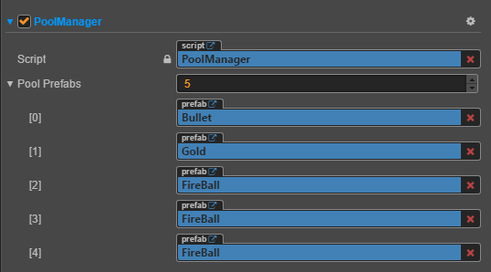

## **对象池封装**
***
> [Cocos Creator- NodePool 介绍 ](https://docs.cocos.com/creator/manual/zh/scripting/pooling.html)

> 编辑器  
> 

> 使用

```js
    window.PoolType = cc.Enum({
        BULLET: 0,
        GOLD: 1,
    });
    //获得节点
    window.poolManager.getNode(PoolType.GOLD)
    //返还节点
    window.poolManager.putNode(PoolType.GOLD)
```

PoolManager.js
```js
cc.Class({
    extends: cc.Component,

    properties: {
        poolPrefabs: [cc.Prefab], //需要管理的prefab 放入进来
        _nodesPool: [], // 存储对应的cc.NodePool
    },

    // LIFE-CYCLE CALLBACKS:

    onLoad() {
        window.poolManager = this;// 全局方便使用
        this.poolPrefabs.forEach(element => {
            let np = new cc.NodePool();
            this._nodesPool.push(np);
        });
    },

    start() {

    },

    // 创建并缓存节点 - 如果需要提前缓存，可以调用。
    genNode(type) {
        let prefab = this.poolPrefabs[type];
        let node = cc.instantiate(prefab);
        node.active = false;
        this._nodesPool[type].put(node);
    },
    //获得节点
    getNode(type) {
        let node = null;
        if (this._nodesPool[type].size() > 0) { // 通过 size 接口判断对象池中是否有空闲的对象
            node = this._nodesPool[type].get();
        } else { // 如果没有空闲对象，也就是对象池中备用对象不够时，我们就用 cc.instantiate 重新创建
            node = cc.instantiate(this.poolPrefabs[type]);
        }
        return node;
    },
    //返还节点
    putNode(type, node) {
        this._nodesPool[type].put(node);
    },
    //释放所有节点
    clearAllNode(type) {
        this._nodesPool[type].clear();
    }

    // update (dt) {},
});
```